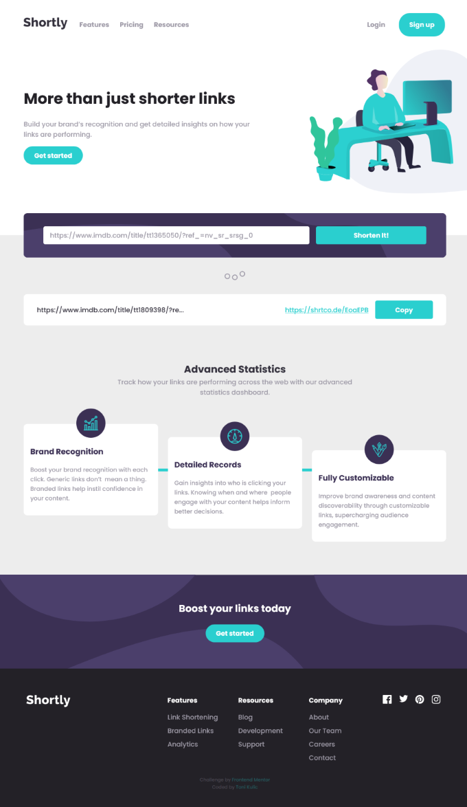

# Shortly - URL shortening App

This is a solution to the [Shortly URL shortening API Challenge challenge on Frontend Mentor](https://www.frontendmentor.io/challenges/url-shortening-api-landing-page-2ce3ob-G). Frontend Mentor challenges help you improve coding skills by building realistic projects.

## Table of contents

-   [Challenge](#challenge)
-   [Links](#links)
-   [Technologies](#technologies)
-   [Wokflow](#workflow)
-   [Sources](#sources)
-   [Screenshots](#screenshots)
-   [Author](#author)

## Challenge

Users should be able to:

-   View the optimal layout for the site depending on their device's screen size
-   Shorten any valid URL
-   See a list of their shortened links, even after refreshing the browser
-   Copy the shortened link to their clipboard in a single click
-   Receive an error message when the `form` is submitted if:
    -   The `input` field is empty

## Links

-   [Solution on Frontend Mentor](https://www.frontendmentor.io/solutions/react-scss-shrtcode-api-sessionstorage-clipboard-api-wbayhjxMP)
-   [Live website](https://tkulic.github.io/url-shorty)
-   [GitHub repository](https://github.com/tkulic/url-shorty)

## Technologies

-   Semantic HTML5 markup
-   SCSS
-   [React](https://reactjs.org/) - JS library (Functional components & Hooks)
-   [Clipboard API](https://developer.mozilla.org/en-US/docs/Web/API/Clipboard_API) of the Navigator object
-   [Session storage](https://developer.mozilla.org/en-US/docs/Web/API/Window/sessionStorage)
-   [Shrtcode API](https://shrtco.de)

## Workflow

1. Project initialization as a public repository on GitHub
2. Planning out HTML structure and CSS classes based on design files
3. Creating well-structured content as React components with JSX
4. Styling the page from top to bottom by utilizing _mobile-first_ approach
5. Adding media queries for desktop layout
6. Implementing main functionality of the website - shortening valid URLs
7. Integrating Session storage to prevent losing results after refreshing the browser
8. Configuring repository to publish code with GitHub Pages

## Sources

-   Icons and logos: [Remixicon](https://remixicon.com/)
-   Animated loader: [Preloaders](https://icons8.com/preloaders/)
-   [Shrtcode API Docs](https://shrtco.de/docs/)
-   [MDN Web Docs](https://developer.mozilla.org/en-US/)

## Screenshots

## Author

-   GitHub profile - [Toni Kulić](https://github.com/tkulic)
-   Frontend Mentor - [@tkulic](https://www.frontendmentor.io/profile/tkulic)
